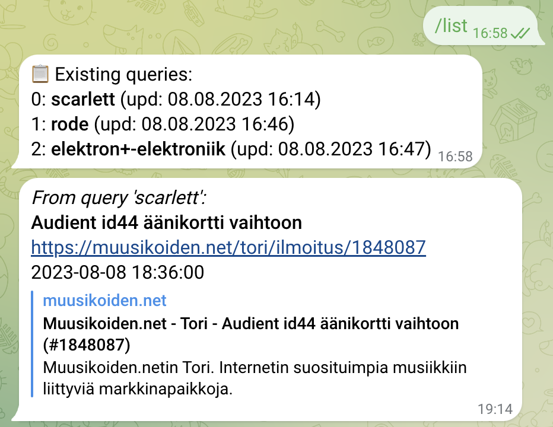

# Muusikoiden.Net market monitor
Regularly polls https://muusikoiden.net/tori/haku.php with user-defined search queries and returns new listings via a dedicated Telegram bot.

User interface in Telegram:
# 

## Installation
### 1. Create a Telegram bot
- In Telegram, open a chat with `@BotFather`
- Create a bot `/newbot`, give it a name, e.g. `muus_watcher_bot`
- Record the provided HTTP API token
- Navigate to the configuration menu: `/mybots` -> select the bot -> `Edit Bot`
  - Set the bot picture: select `Edit Botpic` and upload the provided `bot_pic.png`
  - Configure the user interface: select `Edit Commands` and paste the contents of `bot_commands.txt`
### 2. Configure the server
- Install [miniconda](https://docs.conda.io/projects/miniconda/en/latest/)
- Create a conda environment: `conda env create -f environment.yml`
- In `main.py`:
  - Specify your bot token in `TG_BOT_TOKEN = ""`
  - (optional) Configure the update interval, i.e. how often to fetch the listings - `QUERY_EXEC_INTERVAL` (1 hour by default)

## Usage
### 1. Start the server
```bash
conda activate muus_watcher
python main.py
```
The server saves its state to `db.yaml` and restores it on restart.

### 2. Configure listing search of your interest
- In Telegram, open a chat with `@{your_bot_name}`
- Register new user `/start`
- Add search query, e.g. `/add arturia keylab -88` (includes listings with "Arturia", "Keylab", and without "88"). The query will be triggered once added and then repeatedly run with update interval specified above
- Inspect `/list` and remove queries (`/remove _`, `/clear`) as need.

## Limitations
- The server currently considers only the first page of query search results returned by https://muusikoiden.net/ . This means that if there are more 1 page of new listings added during the update interval, the earliest ones will not be reported in Telegram.
- The server reports the listings that were added or modified since the previous query search. Practically, this often results in repeated notifications if the seller edits their listing.

## License

The code is licensed under CC-BY-4.0 license.

This software is not an offical product of https://muusikoiden.net/ team. Any use of this software, including commerical, is at your own risk. Excessive use (thousands of users/queries, short update intervals) may affect accessibility of https://muusikoiden.net/ website and, thus, must be avoided.
